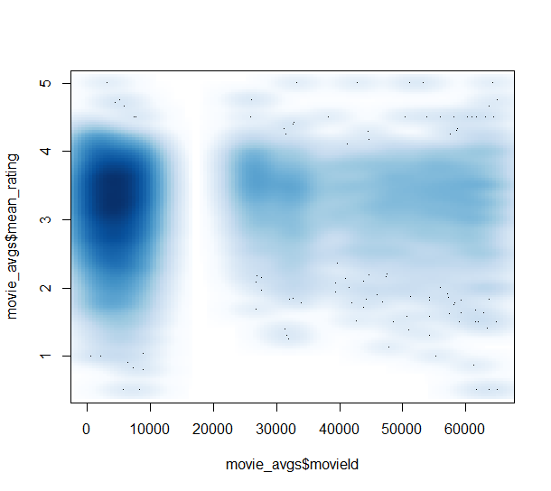

```{r setup, include=FALSE}
knitr::opts_chunk$set(echo = TRUE)
```

## Overview
With the rapid proliferation and availability of streaming movie content, it is now easier to watch movies than ever before!  In addition, with the number of service providers in the market it has increased the amount of available content dramatically.  It is possible today to find immediate access to nearly any major film release in history from the comfort of our homes.  But, as they say, with great power comes great responsibility, we now must make a choice on what to watch and not squander our precious viewing time with indecisiveness or a poorly selected film which will leave us with the feeling of remorse  Fortunately, through a combination of knowledge gained from the EDX HarvardX Data Science Professional Certificate program, and the publicly available MovieLens dataset there is help!

The goal of this project is to produce a movie recommendation system, which will leverage statistical and machine learning techniques to help predict the rating of a film.  Like we described earlier, with so much content available, we are constrained in our time available to watch every movie.  We want to know the films we will enjoy the most (and thus would rate the highest) so we can prioritize what to watch.  GroupLens (http://grouplens.org) is a research lab that is part of the University of Minnesota and one of the projects this lab works on is called MovieLens.  The MovieLens (http://movielens.org) project is a web site focused on movie recommendations and has graciously made available several of their datasets for use which are provided via GroupLens Reseach.  In the case of this project, we are utilizing the MovieLens 10M dataset (https://grouplens.org/datasets/movielens/10m/) , which includes 10 million ratings of 10,000 different movies.  This is the smaller and more computational friendly alternative to the larger 25M dataset which includes 25 million ratings of 62,000 movies!

In order to build our recommendation system using this data, the general approach was to first obtain this data and conduct an initial discovery to understand some of the features and characteristics of the dataset.  This helped to identify some data cleaning steps, and get us thinking about how to model the information for our recommendation engine.  The dataset was divided into training and validation sets to avoid overfitting our model and the impact of several features were evaluated to help drive the accuracy.  A technique known as regularization was leveraged to ensure that small sets of extremes in ratings did not overly influence the model we had created.  Ultimately our model was tested against the original, untouched validation dataset and indicated a noticeable increase in accuracy over simply the population mean, or the expected rating one would obtain by just choosing a random film, or making a guess based on title, etc.  In the sections that follow, we will review the steps and the process followed for building the model in more detail.  

## Methods and Analysis

The software tools used for this project were primarily R (http://www.r-project.org) and RStudio (https://www.rstudio.com) which are a statistical analysis software and an integrated development environment (IDE) to make using R a little easier and more productive with additional workspace functionality and project functionality (R, Rstudio respectively).  Several packages were added to the base R installation to support this work, including “tidyverse”, “caret”, “data.table”, and “lubridate”.  For support and reference along the way Rafael Irizarry’s “Introduction to Data Science: Data Analysis and Prediction Algorithms with R” was also relied upon as reinforcement for the statistical and machine learning concepts/topics reviewed in this courses for this professional certificate.

As previously mentioned, the data used for this project is the MovieLens 10M dataset provided by the GroupLens project.  This 63MB dataset containing 10 million records was sourced from http://files.grouplens.org/datasets/movielens/ml-10m.zip unzipped, and loaded into R using code provided at the start of this project.  That same code provided also conveniently loaded the data to tidy format so that it was structured in a table with lines representing observations – in this case a single review of a movie by one user.  This data contained several features in the way it was delivered, including the movie title (which upon further review included the year it was released in parenthesis), an id of the reviewer, the date and time of the review, a delimited list of genres the movie was tagged with, and of course the rating provided by that user.  

Our starting code split this population into training and validation datasets, which was done using the r function “createDataPartition” which created an index on the population that is used to segment the two subsets (training & validation).  This index split the population, with 90% going to the training set, and the remaining 10% being held as the validation set.  In order to facilitate this exercise, a data cleaning step was performed to ensure user and movie IDs were present in both the training and validation datasets and add rows removed from the validation data back into the training data.  For reference, the training dataset was labeled as “edx” and the validation dataset was labeled as “validation”

To begin the process of building our model, the next step was to do some basic review and analysis to gain some understanding and familiarity of the data.  The r function “head()” was used to get a visual representation of the first few rows of this table, and confirmed what was called out previously –initial features included the following columns (and my interpretation):

Column Label | Description
------------- | ------------- 
userID | Numeric identification of the user who gave the rating of this movie
movieID | Numeric identification of the movie which was rated
rating | Numeric representation of the movie rating on a scale of 1-5 (5 = best)
timestamp | Epoch formatted datetime value of when the review was done
title | This was the title and (release year) of the movie, formatted as such
genres | Pipe (vertical bar) delimited list of genres with which the review of the movie was tagged

I asked some questions to understand what the edx dataset looked like, and returned either a single calculation, or a basic visualization to aid in this understanding.

* Summary statistics on EDX dataset:
	+ Ratings in the edx data: count(edx) =  9,000,055
	+ Distinct movies: n_distinct(edx$movieId) = 10,677
	+ Distinct users: n_distinct(edx#userId) = 69,878
	+ Mean review: mean(edx$rating) = 3.512
  + Standard deviation of review scores: sd(edx$rating) = 1.06

##### Ratings Historgram  


To help increase the accuracy of our modeling and the results of our recommendation engine, I opted to add some additional features to the data that might be leveraged by our algorithm.  This included adding columns to the data to represent the component datetime pieces of the timestamp.  I did this by first converting the epoch format datetime value to an easy to read (for a person) date time and also creating columns to represent the review year, month, day (as in the day of the month), weekday (Monday, Tuesday, etc), and hour of review.  From our initial glance at the title field, we learned that the release year of the movie was in fact part of the title – for example movieId 122 = “Boomerang (1992)” was released in 1992.  As with the components of the review datetime, I suspected that the year the movie was released might potentially impact the rating and decided to split this out as an additional feature.  The following code was used to take the substring of the title which fell between the parenthesis and populate a new feature, year_extract with that information:

```{r eval=FALSE}
   edx <- edx %>% 
   mutate( year_extract = 
        as.numeric(
             str_sub(
                  substrRight(title,5)
             , end = -2
                     )
                    )
                   )
```

Out of curiosity, I wanted to see that the oldest film in the dataset was.  The following code revealed that “The Birth of a Nation”, released in 1915 was the oldest film in the edx dataset.  

```{r eval=FALSE}
   edx[which.min(edx$year_extract),] %>% select(title, rating, year_extract)
```

Once we had both the year of the film’s release and the review year, I considered that the age of the film (at the point of review) might be a factor.  Like wine, some films would possibly age better than others and this could be an important feature for our recommendation system to leverage.  To do this, another column was added to the dataset, the age_at_review feature, which simply took the review_year – year_extract.  I did a few manual checks to confirm this worked correctly, which a visual inspection of this code and it's results confirmed:

```{r eval=FALSE}
   edx <- edx %>% mutate( age_at_review = edx$review_year - edx$year_extract)

   edx[1:10,] %>% select(title, year_extract, review_year, age_at_review)
```

I was curious what the “oldest” film was at the time of review, and unsurprisingly “The Birth of a Nation”, which we already established as the oldest film in our data received a review 93 years after release (notably received an above average rating of 4 compared to the full population’s naïve mean rating of 3.51)

```{r eval=FALSE}
   edx[which.max(edx$age_at_review),] %>% 
   select(title, rating, year_extract, review_year, age_at_review)
```

Now that we had done some additional data preparation and cleaning and enhanced our data will several features to support our recommendation engine, it was time to begin the process of developing our algorithm.  First and foremost, the method for evaluating our model accuracy needed to be established.  In this case, we will be using the typical error loss calculated via the residual mean squared error (RMSE).  The RMSE is effectively the error we expect in our predicted movie rating and can be thought of like a standard deviation for the accuracy of our prediction.  To facilitate testing, a function was created to easily evaluate the RMSE of our model using two vectors, the actual ratings from our data, and the predicted ratings from our algorithm.

$RMSE = \sqrt{ mean( \text{ true_ratings} - \text{ predicted_ratings})^2}$

```{r eval=FALSE}
   RMSE <- function(true_ratings, predicted_ratings)
   {sqrt(mean((true_ratings – predicted_ratings)^2))}
```

To establish a baseline for our model accuracy, we can first take an average rating across the entire population.  In the case of the edx dataset which we are using for training our model, this yields a result of 3.51.  If we were to run this straight average through the loss function we get an RMSE of 1.06.  This effectively tells us if we just assume everything has a rating of 3.5 (out of 5), we can expect our review to be off by about 1 star.  This isn’t a very good model, so clearly we should work to build out a better algorithm for recommending movies!  

```{r eval=FALSE}
   mu <- mean(edx$rating)

   RMSE(validation$rating, mu)
   1.06
```

By modeling the effects of the different data features in our dataset we can allow our model to incorporate these into the predicted rating and reduce our RMSE.  The way these effects were modeled is to essentially look at the mean ratings across groups of films with the same value of a given attribute, after subtracting the mean rating across the entire population and any other effects which may have already been modeled out.  To begin, we will model the effect of a given movie first.  In short, we know that some movies are better than others and in general would have a higher rating across all reviews for example.  Isolating this impact from the overall population mean review and using it as a factor in our model will likely reduce our RMSE.  To determine this movie effect, we will summarize the training population by movie (using movieId) and determine the mean score for each film less the population average.  In other words, we will get a score that tells us how far from the population mean of 3.51 each film is rated (on average).  

```{r eval=FALSE}
   movie_avgs <- edx %>% 
   group_by(movieId) %>% 
   summarize(b_i = mean(rating – mu), mean_rating = mean(rating))
```

I also visualized the mean ratings of all our movies, and as shown below there were movies which clearly had mean review scores above and below the population average.

```{r eval=FALSE}
plot(movie_avgs$movieId, movie_avgs$mean_rating)
```


##### Mean Rating by Movie



The next step was to incorporate each film’s score from this summary back into the original estimate that used just the population overall mean. The predicted rating for a movie became the population mean (mu) + the effect of that individual film’s overall ratings.  The resulting impact in the model’s RMSE can be evaluated with the following code:

```{r eval=FALSE}
   Predicted_ratings <- mu + validation %>% 
   left_join(movie_avgs, by = ‘movieId’) %>% 
   pull(b_i)

   RMSE(predicted_ratings, validation$rating)
```

This reduced our RMSE from 1.06 to .944, which was a considerable increase in model accuracy. We could do better though, and so we would next leverage additional features and continue to refine the model.  The next step was to model and enhance the algorithm by including the effect of a given user. The explanation is that some folks will simply tend to score movies higher or lower than the population mean of 3.51.  To model this effect, we will follow a similar pattern as we did for the user effect, but we will remove the existing factors of the population mean and the movie factor which was just determined. 

```{r eval=FALSE}
   User_avgs <- edx %>%
   left_join(movie_avgs, by = ‘movieId’) %>%
   group_by(userId) %>%
   summarize(b_u = mean(rating – mu – b_i), mean_rating = mean(rating))
```

We can observe this user bias by visualizing the mean rating by user.  While we do see users consistently rate between 3 and 4, there are some users here who clearly rate on average above or below the population mean.


##### Mean Rating by User ID


Now that we have both a movie and user bias, we can incorporate these into our algorithm and evaluate by following the same approach as with only the movie effect.  In this instance though, we are basing our prediction off of three components: mu (the population mean), b_i (the effect on rating of that individual film), and b_u (the effect on the rating of that specific user) via the following code:

```{r eval=FALSE}
   predicted_ratings <- validation %>%
   left_join(movie_avgs, by = 'movieId') %>% 
   left_join(user_avgs, by = 'userId') %>% 
   mutate(pred = mu + b_i + b_u) %>% 
   pull(pred)
	
   RMSE(predicted_ratings, validation$rating)
```

Our results will again yield an improvement in loss over just the mean, as our RMSE is now .8653.  By continuing down this approach with our additional data features and adjusting our algorithm to include the effect, we will get an even greater increase in the accuracy and performance of our model.  The additional effects that were factored in included the year of movie release, the year of review, month of review, weekday (1-7) of review, day of month of review, the hour of review, the genres with which the film was tagged, and the age of the film (based on the difference between release year and review year).  This combination of 10 effects is extensively documented in the source code provided, and the final algorithm for this phase of our model development looked like the code below.  Note that while this code is joining to the validation set to produce our predicted ratings for the purpose of testing the model accuracy, at no point in the development of our model was the validation data used; the effect of each feature in our data was only modeled through the use of the training data (the edx dataset):

```{r eval=FALSE}
   predicted_ratings <- validation %>% 
   left_join(movie_avgs, by = 'movieId') %>% 
   left_join(user_avgs, by = 'userId') %>% 
   left_join(movie_year, by = 'year_extract') %>% 
   left_join(year_group, by = 'review_year') %>%
   left_join(month_group, by = 'review_month') %>%
   left_join(mDay_group, by = 'review_mday') %>%
   left_join(day_group, by = 'review_day') %>%
   left_join(review_age, by = 'age_at_review') %>%
   left_join(genre_group, by = 'genres') %>%
   left_join(time_group, by = 'review_hour') %>%
   mutate(pred = mu + b_i + b_u + b_y + b_ry + b_rm + b_rd + b_rwd + b_a + b_g + b_h) %>% 
   pull(pred)

   RMSE(predicted_ratings, validation$rating)
   .8643
```


The score for our model at this point was .8643, which is a considerable increase over the naïve mean of the population and is also below the established threshold target for the maximum score.  However, in the pursuit of excellence, there was still an opportunity to improve the accuracy of the prediction.  To this point, the weighting, or strength of these effects have been calculated without any respect to the population size or weighting.  What this means is that the effect of a user with a single review provides just as much weighting on our prediction as the effect of a user with 500 reviews.  To help adjust this properly for our algorithm we will leverage a technique known as regularization.  Regularization in essence reduces the weighting placed on each effect when it is calculated based on a small population size, in return driving that prediction closer towards the overall population mean.  This is accomplished by dividing our calculated effect by the population size plus a factor of lambda.  

To implement regularization in our model we need to do two things, revise the formula we use to model each of our effects, and determine the appropriate factor of lambda to optimize the model output.  As mentioned above, there is considerable detail and explanation available in the source code for this analysis so for the purposes of this article we will provide an overview and summary of the code used.  The implementation for regularization includes making a revision to the way we calculated each effect in our original algorithm, as outlined below:

Movie effect:

* Our original effect calculation looked like this:

*	Calculate the effect by summarizing the score for each movie less the population mean

```{r eval=FALSE}
   Movie_avgs <- edx %>%
   group_by(movieId) %>%
   summarize(b_i = mean(rating))
```

*	Regularization involves adjusting this effect for the population size, and is implemented by the following approach 

```{r eval=FALSE}
   Movie_avgs_reg <- edx %>%
   group_by(movieId) %>%
   summarize(b_i_reg = sum(rating-mu) / (n() + “lambda”)
```

   where:
   
   n() is the population size, in this case the number of reviews of each movie 
   
   “lambda” is the aforementioned factor which we will tune and use to apply as an overall weighting for regularization of each effect.  


To determine the value for lambda, we tested several possible values to find what would provide us with the lowest RMSE when run through our model.  To perform this tuning for lambda, we needed to test several possible lambda values and the resulting RMSE without touching our validation data.  To do this, I leveraged a technique known as cross validation.

The cross-validation process involved dividing the training data into 10 subsets of data, each of which was then split into a training and validation set.  Following the assumptions that my full training dataset mirrored the same characteristics and distribution as our validation data, and that the random subsets of 10% of the training data would also produce a dataset with the same feature distributions gave us 10 new training and 10 new validation datasets to utilize for tuning lambda allowing us to perform this training without involving the baseline validation dataset to avoid overfitting.  The exact code and detailed comments are available in the source code for this project, and the following provides an overview of the approach.

* Step 1: create a vector of possible lambda values, from 1 to 10 with an increment of .25

     lambdas <- seq(1,10,.25)

* Step 2: create an index of 10 randomly partitioned datasets from our training data

     bootstrapindex <- createFolds( y = edx$rating, k = 10, list = TRUE, returnTrain = FALSE)

* Step 3: Implement a nested set of sapply & functions to do the following:
     
     + For each of the 10 cross fold validation sets from “bootstrapindex”:
     
     + Create a further split in this dataset to divide it into a training and test population
          
     + ”s” represents each iteration of the 10 folds created in step 2

```{r eval=FALSE}
    bootstrap_split <- 
    createDataPartition(
       y = edx[bootstrapindex[[s]],], 
       times = 1, 
       p = .1, 
       list = FALSE)
```
* Using this index, create a train and validation set for tuning lambda:

```{r eval=FALSE}
   train_set <- edx[ bootstrapindex[[s]][-bootstrap_split],]
      
   validation_set <- edx[ bootstrapindex[[s]][bootstrap_split],]
```

* At this point I ran the algorithm for each of the 10 folds of the edx data (the training set) using each of the possible lambda values to train the algorithm, just as had previously been done:
         
```{r eval=FALSE}
   movie_avgs_reg <- train_set %>% 
   group_by(movieId) %>% 
   summarize(b_i = sum(rating - mu_train)/(n()+l))
```
* l represents the current lambda value for the iteration
* this example is shown calculating the movie effect with regularization


The nested set of sapply() functions essentially performed like this:

* for each fold
+ split the fold into training & test sets
+ for each training set  
+ iterate through each value of lambda
+ run the algorithm to train our model with that lambda
+ provide the lambda value which minimized RMSE
+ produce the list of the 10 lambda values which minimized RMSE (from each of the 10 datasets)

Ultimately, the code produced a set of 10 lambda values which had the lowest RMSE provided by each fold’s training set building the algorithm and that fold’s respective test set being used for testing the accuracy.  The mean lambda from this population was thus determined to be our optimal lambda value.  The complete details of the approach are of course provided and commented in detail in the source code, and the final tuned lambda (stored in our code as final_lambda) was 5.05.  With this final lambda value, I re-ran the entire model using the complete training set with this final lambda value.  The complete code is available, but followed a familiar pattern for modelling each effect:

```{r eval=FALSE}
   movie_avgs_reg_final <- edx %>%
   group_by(movieId) %>%
   summarize(b_i = sum(rating - mu)/(n()+final_lambda))
```

## Results

Now that I had the final algorithm completed, this was used to build the final set of predictions by repeating the effect modeling, and ultimately build a prediction dataset from the movie reviews in the validation population against which we would test to find our final RMSE. That final test was performed via the following code:

```{r eval=FALSE}
   RMSE(predicted_ratings_reg_final, validation$rating)
```

* where:

* predicted_ratings_reg_final: the final set of predicted ratings

* validation$rating: the actual ratings from the validation dataset

The final RMSE for the algorithm after implementing regularization and tuning for lambda was .8638.  This was based on our tuned lambda which across multiple optimization runs would always be around 5.05.  In essence, this was developed with an algorithm that performed the following steps:

1.Loaded the MovieLens 10M dataset and converted this into tidy format.

2.Split this dataset into training (edx) and validation (validation) datasets.

3.Performed data cleansing and enhancement by adding some additional derived features to the data.

4.Reviewed several of the features by visualizing them over the training population (ratings vs movie year, user, etc).

5.Calculated an initial recommendation algorithm by modeling the effects of several key attributes in the data.

6.Applied regularization to properly penalize the weighting effect of small populations.

7.Leveraged bootstrap and 10 fold cross-validation to optimize the tuning parameter lambda without overfitting by training and testing on the 10 sets of training (train_set) and validation (validation_set) data produced from the original training data (edx).

8.Re-trained the original model with the tuned lambda value for a final RMSE that was improved from 1.06 to .8638

## Conclusion

I found the process of going through this project not only rewarding and fun, but also a great way to reinforce some of the techniques we have learned about and encourage the discovery of some new features.  For example, I had not used the caret function “createFolds” in the course material but found it quite helpful in my bootstrap and cross validation testing work.  One thing I found interesting was that in performing some final tests of my code, there value for final_lambda did fluctuate a but between runs ranging at times from 4.85 to 5.10; this did not appear to impact the final RMSE calculated against the validation set as this remained consistent.  When I went through and added the individual RMSE scores to each run of lambda testing, I noticed the variation in RMSE during this tuning was at 5-6 significant digits which was interesting.

If I were to continue development to further enhance the accuracy of the solution, the next steps would include some of the following ideas:

* Splitting the components of the “Genres” attribute into distinct entries, for example “Drama | Romance” would be split into two separate features which would behave as binary Yes/No type data points associated to each file.  We could then model the effect of each genre a file was tagged with in addition to the specific list or set of tags.  We might see some user-genre specific behaviors here as well.

* Approaching the solution via some different applications of machine learning techniques or algorithms, for example using random forests to generate a decision tree for modeling the predicted score.  This approach would come with its own set of advantages and challenges to solve for as well in terms of dimensionality, although a similar approach would be implemented for parameter tuning.  
   
It would be an interesting exercise to test this model against some of the other MoveLens datasets with similar structure but different populations to see if we could obtain a different accuracy level.  With regard to the overall solution developed though, it is particularly functional that as additional data (reviews) are added to the population or if another dataset with similar features were to be provided the entire model can easily be run again on the new dataset.  The complete process of data cleaning, feature development, training, lambda tuning with cross-validation for regularization, building the final algorithm, and producing the final loss calculation is all performed at run-time.  Imagine an implementation which could aggregate review data across all the reviews an online streaming service might have and conduct this modeling in real-time as users are looking for the next film to watch.

It is my hope that as the reader and reviewer you have made it this far and found this informative.  A considerable amount of time was put into the development of the model, the testing, and ultimately this report.  While this report may feel lengthy it is a good representation of both the level of effort and detail put into the solution, and also the excitement for which I have on this subject.  Looking back at the time investment, this was a very enjoyable exercise for me to go through and reinforce so much of the content we have studied as participants in the data science program.  I look forward to continued opportunities to leverage this knowledge and refine and grow my understanding of this space – and hopefully we might have an opportunity to cross paths and work together at some point!
